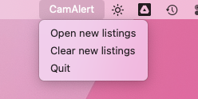

# CamAlert
A Python 3 app that sends a notification if there's a new analog camera available on 2dehands (the Ebay of Belgium).
The app runs in the background on macOS and sends a system notification of it sees a new deal is available.
Beautiful Soup is used as HTML parser.

 
# Features
- Background check for new listings every 60 seconds
- Sends system notification with listing title if it finds a new listing
- Status bar icon with following options:
  - Open all new listings in the default browser
  - Clear all new listings (in case you haven't used the app in a while and don't want it to open 50+ Chrome tabs)
  - Quit the application

# Requirements to build
You need `py2app` to compile the app yourself.

Use `pip install -U py2app` to install it.

From the root of the project folder, run `python setup.py py2app -A` in the terminal to compile the app in Alias mode. The app is ready to open and test in the `dist` folder.

If everything works fine, and you want to create a stand-alone version, you have to remove the build and dist folder (`rm -rf build dist`). Then run `python setup.py py2app` to build the app. The stand-alone build is available in the `dist` folder.